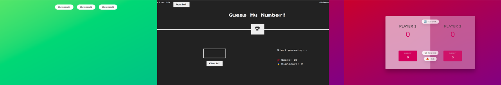

- **Guess my number:** A simple game that invites users to draw numbers randomly selected by the computer.
- **Modal window:** DOM manipulation to display modal.
- **Pig game:** Play with your friends. Roll dice and reach 100 points to win the game.

These three mini projects are basic DOM manipulation exercises from the JavaScript course I took on Udemy, Instructor is Jonas Schmedtmann.

[The Complete JavaScript Course 2025: From Zero to Expert!](https://www.udemy.com/course/the-complete-javascript-course/)

### Things I learned

- Basic DOM manipulaiton
- Implement javascript logic to create CSS according to circumstances
